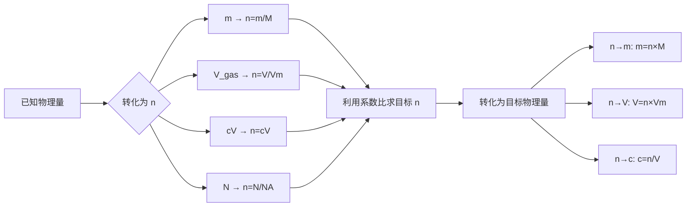

> **章节**：人教版必修一 第二章第三节  
> **核心思想**：化学方程式中各物质的系数之比 = 物质的量之比  
> **前置知识**：物质的量 $n$、摩尔质量 $M$、气体摩尔体积 $V_m$、物质的量浓度 $c$  
> **更新**：2026-06-18

---

## 📚 目录

- [一、核心原理](#一核心原理)
  - [1.1 系数与物质的量的关系](#11-系数与物质的量的关系)
  - [1.2 解题总思路](#12-解题总思路)
  - [1.3 核心流程总结](#13-核心流程总结)
- [二、基本计算类型](#二基本计算类型)
  - [2.1 纯物质参与反应的计算](#21-纯物质参与反应的计算)
  - [2.2 涉及气体体积的计算](#22-涉及气体体积的计算)
  - [2.3 涉及溶液浓度的计算](#23-涉及溶液浓度的计算)
  - [2.4 "关系式"法在多步反应中的应用](#24-关系式法在多步反应中的应用)
- [三、进阶计算类型](#三进阶计算类型)
  - [3.1 差量法](#31-差量法)
  - [3.2 过量计算（判断过量问题）](#32-过量计算判断过量问题)
  - [3.3 混合物计算](#33-混合物计算)
  - [3.4 反应先后顺序问题](#34-反应先后顺序问题)
  - [3.5 守恒法（电子守恒/质量守恒/电荷守恒）](#35-守恒法电子守恒质量守恒电荷守恒)
  - [3.6 极值法（取值范围分析）](#36-极值法取值范围分析)
  - [3.7 涉及不纯物的计算](#37-涉及不纯物的计算)
  - [3.8 产率与转化率计算](#38-产率与转化率计算)
- [四、综合题型全解](#四综合题型全解)
- [五、易错点汇总](#五易错点汇总)
- [六、公式速查表](#六公式速查表)
- [七、自测题（15 题）](#七自测题15-题)

---

# 一、核心原理

## 1.1 系数与物质的量的关系

对于化学方程式：

$$\boxed{aA + bB = cC + dD}$$

各物质的**系数之比** = **物质的量之比** = **粒子数之比**（在相同条件下，气体体积之比也等于系数之比）

$$\frac{n(A)}{a} = \frac{n(B)}{b} = \frac{n(C)}{c} = \frac{n(D)}{d}$$

> **核心原理**：化学方程式中各物质化学计量数（系数）之比，等于各物质的物质的量之比。

### 举例说明

$$\text{2Na} + \text{2H}_2\text{O} = \text{2NaOH} + \text{H}_2\uparrow$$

| 物质 | Na | H₂O | NaOH | H₂ |
|------|----|------|------|----|
| 系数（分子数比） | 2 | 2 | 2 | 1 |
| 物质的量比 | 2 | 2 | 2 | 1 |

即：$n(\text{Na}) : n(\text{H₂O}) : n(\text{NaOH}) : n(\text{H₂}) = 2 : 2 : 2 : 1$

> 所以，若有 4 mol Na 完全反应，则消耗 4 mol H₂O，生成 4 mol NaOH 和 2 mol H₂。

---

## 1.2 解题总思路

```
已知量 → 转化为物质的量 n → 根据系数比求目标物质的 n → 转化为目标物理量
             ↓                   ↓                    ↓
       n = m/M              n(A)   n(B)           m = n·M
       n = V/V_m           ──── = ────           V = n·V_m
       n = c·V             a(A)   a(B)           c = n/V
```

> 一句话总结：**"见量先化 n，系数定比例，列式解出 n，转换得答案。"**

---

## 1.3 核心流程总结



---

# 二、基本计算类型

## 2.1 纯物质参与反应的计算

### 解题步骤

1. 设未知量（通常设所求物质的物质的量为 $x$）
2. 写出配平的化学方程式
3. 在对应物质下方标出系数比
4. 在系数下方标出已知和未知的物质的量
5. 列比例式求解

### 例 1 · 已知反应物质量，求生成物质量

> **题目**：将 5.4 g 铝投入足量稀硫酸中，充分反应。求生成的氢气的质量。

**解**：

$$\text{2Al} + \text{3H}_2\text{SO}_4 = \text{Al}_2(\text{SO}_4)_3 + \text{3H}_2\uparrow$$

(1) 先转化为物质的量：

$$n(\text{Al}) = \frac{m}{M} = \frac{5.4}{27} = 0.2 \text{ mol}$$

(2) 设生成 H₂ 的物质的量为 $x$：

```
         2Al    +    3H₂SO₄   =   Al₂(SO₄)₃  +   3H₂↑
系数比     2                     3
物质的量   0.2                             x
```

(3) 列比例：

$$\frac{2}{0.2} = \frac{3}{x}$$

$$x = \frac{0.2 \times 3}{2} = 0.3 \text{ mol}$$

(4) 转化为质量：

$$m(\text{H₂}) = n \times M = 0.3 \times 2 = 0.6 \text{ g}$$

**答案**：生成 0.6 g H₂。

---

### 例 2 · 已知生成物质量，求反应物质量

> **题目**：实验室用加热 KClO₃ 和 MnO₂ 混合物的方法制取氧气，若要制得 4.8 g 氧气，至少需要 KClO₃ 的质量是多少？

**解**：

$$\text{2KClO}_3 \xrightarrow[\Delta]{\text{MnO}_2} \text{2KCl} + \text{3O}_2\uparrow$$

(1) 转化为物质的量：

$$n(\text{O}_2) = \frac{4.8}{32} = 0.15 \text{ mol}$$

(2) 设需要 KClO₃ 的物质的量为 $x$：

```
     2KClO₃    =    2KCl   +    3O₂↑
系数   2                        3
n     x                      0.15
```

$$\frac{2}{x} = \frac{3}{0.15}$$

$$x = \frac{2 \times 0.15}{3} = 0.1 \text{ mol}$$

(3) 转化为质量：

$$m(\text{KClO}_3) = n \times M = 0.1 \times 122.5 = 12.25 \text{ g}$$

**答案**：至少需要 12.25 g KClO₃。

---

### 例 3 · 同时求多个量的计算（规范模板）

> **题目**：1.56 g Na₂O₂ 与足量 CO₂ 反应，求生成 O₂ 的质量和标况下的体积。

**解**：

$$\text{2Na}_2\text{O}_2 + \text{2CO}_2 = \text{2Na}_2\text{CO}_3 + \text{O}_2$$

(1) 求 Na₂O₂ 的物质的量（$M = 78 \text{ g/mol}$）：

$$n(\text{Na}_2\text{O}_2) = \frac{1.56}{78} = 0.02 \text{ mol}$$

(2) 求 O₂ 的物质的量：

```
     2Na₂O₂    +    2CO₂   =   2Na₂CO₃   +   O₂
系数   2                                   1
n     0.02                                x
```

$$\frac{2}{0.02} = \frac{1}{x} \implies x = \frac{0.02 \times 1}{2} = 0.01 \text{ mol}$$

(3) 转化为所求物理量：

$$m(\text{O}_2) = 0.01 \times 32 = 0.32 \text{ g}$$

$$V(\text{O}_2) = 0.01 \times 22.4 = 0.224 \text{ L}$$

**答案**：生成 O₂ 0.32 g，标况下体积 0.224 L。

---

## 2.2 涉及气体体积的计算

> 体积计算先在标况下转化为物质的量，再用系数比求解。

### 例 4 · 生成气体体积

> **题目**：足量锌与 200 mL 2 mol/L 的盐酸反应，求生成 H₂ 在标况下的体积。

**解**：

$$\text{Zn} + \text{2HCl} = \text{ZnCl}_2 + \text{H}_2\uparrow$$

(1) 求 HCl 的物质的量：

$$n(\text{HCl}) = c \times V = 2 \times 0.2 = 0.4 \text{ mol}$$

(2) 设生成 H₂ 的物质的量为 $x$：

```
     Zn   +   2HCl   =   ZnCl₂   +   H₂↑
系数          2                     1
n           0.4                    x
```

$$\frac{2}{0.4} = \frac{1}{x} \implies x = 0.2 \text{ mol}$$

(3) 转化为体积：

$$V(\text{H}_2) = 0.2 \times 22.4 = 4.48 \text{ L}$$

**答案**：生成 H₂ 4.48 L（标况下）。

> **注意**：当条件为非标况时，应使用 $PV = nRT$ 公式进行换算（高中扩展内容）。

### 例 5 · 气体体积与质量综合

> **题目**：将 7.8 g Na₂O₂ 投入足量水中，充分反应。（1）生成的气体在标况下体积是多少？（2）若把反应后的溶液加水稀释至 500 mL，求所得 NaOH 溶液的物质的量浓度。

**解**：

$$\text{2Na}_2\text{O}_2 + \text{2H}_2\text{O} = \text{4NaOH} + \text{O}_2\uparrow$$

(1) $n(\text{Na}_2\text{O}_2) = \frac{7.8}{78} = 0.1 \text{ mol}$

(2) 先设生成 O₂ $x$ mol，NaOH $y$ mol：

```
     2Na₂O₂   +   2H₂O   =   4NaOH   +   O₂↑
系数    2                   4           1
n     0.1                  y           x
```

$$\frac{2}{0.1} = \frac{4}{y} \implies y = 0.2 \text{ mol}$$

$$\frac{2}{0.1} = \frac{1}{x} \implies x = 0.05 \text{ mol}$$

(3) O₂ 体积：$V = 0.05 \times 22.4 = 1.12 \text{ L}$

(4) NaOH 浓度：$c = \frac{0.2}{0.5} = 0.4 \text{ mol/L}$

**答案**：（1）O₂ 1.12 L；（2）$c(\text{NaOH}) = 0.4 \text{ mol/L}$

---

## 2.3 涉及溶液浓度的计算

### 例 6 · 由反应求溶液浓度

> **题目**：将 2.3 g 金属钠投入足量水中，完全反应后所得溶液的体积为 200 mL。求所得 NaOH 溶液的物质的量浓度。

**解**：

$$\text{2Na} + \text{2H}_2\text{O} = \text{2NaOH} + \text{H}_2\uparrow$$

(1) $n(\text{Na}) = \frac{2.3}{23} = 0.1 \text{ mol}$

(2) 设生成 NaOH 的物质的量为 $x$：

```
     2Na   +   2H₂O   =   2NaOH   +   H₂↑
系数   2                   2
n    0.1                  x
```

$$\frac{2}{0.1} = \frac{2}{x} \implies x = 0.1 \text{ mol}$$

(3) $c(\text{NaOH}) = \frac{0.1}{0.2} = 0.5 \text{ mol/L}$

**答案**：NaOH 溶液的浓度为 0.5 mol/L。

---

### 例 7 · 中和滴定计算（操作流程型）

> **题目**：取待测 NaOH 溶液 20.00 mL，用 0.1000 mol/L 的 HCl 标准溶液滴定，终点时消耗 HCl 溶液 18.00 mL。求待测 NaOH 溶液的物质的量浓度。

**解**：

$$\text{NaOH} + \text{HCl} = \text{NaCl} + \text{H}_2\text{O}$$

(1) 求消耗 HCl 的物质的量：

$$n(\text{HCl}) = c \times V = 0.1000 \times 0.01800 = 1.800 \times 10^{-3} \text{ mol}$$

(2) 由化学方程式：$n(\text{NaOH}) = n(\text{HCl}) = 1.800 \times 10^{-3} \text{ mol}$

(3) 求待测液浓度：

$$c(\text{NaOH}) = \frac{n}{V} = \frac{1.800 \times 10^{-3}}{0.02000} = 0.09000 \text{ mol/L}$$

**答案**：$c(\text{NaOH}) = 0.09000 \text{ mol/L}$

> **中考试题中滴定计算的注意点**：有效数字位数通常与分析仪器精度一致（如滴定管读数保留两位小数）。

---

## 2.4 "关系式法"在多步反应中的应用

> 多步反应中，中间产物不必一一求算，直接写出**最初反应物与最终产物间的计量关系**，一步求解。

### 例 8 · 多步反应的简化计算

> **题目**：将 6.2 g 磷在空气中充分燃烧，产物再与水完全反应。求最终生成的磷酸的质量。

**解**：

多步反应的化学方程式：

$$\text{4P} + \text{5O}_2 \xrightarrow{\text{点燃}} \text{2P}_2\text{O}_5$$
$$\text{P}_2\text{O}_5 + \text{3H}_2\text{O} = \text{2H}_3\text{PO}_4$$

**关系式推导**：
- 由第 1 个方程：$4\text{P} \longrightarrow 2\text{P}_2\text{O}_5$，即 $2\text{P} \longrightarrow \text{P}_2\text{O}_5$
- 由第 2 个方程：$\text{P}_2\text{O}_5 \longrightarrow 2\text{H}_3\text{PO}_4$
- 合起来：$2\text{P} \longrightarrow \text{P}_2\text{O}_5 \longrightarrow 2\text{H}_3\text{PO}_4$
- 即关系式：$\boxed{\text{P} \sim \text{H}_3\text{PO}_4}$

(1) $n(\text{P}) = \frac{6.2}{31} = 0.2 \text{ mol}$

(2) 由 $\text{P} \sim \text{H}_3\text{PO}_4$，得 $n(\text{H}_3\text{PO}_4) = 0.2 \text{ mol}$

(3) $m(\text{H}_3\text{PO}_4) = 0.2 \times 98 = 19.6 \text{ g}$

**答案**：生成 H₃PO₄ 19.6 g。

> **注意**：关系式法找到的 $\sim$ 关系必须经过配平核算，确保原子守恒。

### 例 9 · 关系式法——工业制酸

> **题目**：现有含 FeS₂ 80% 的硫铁矿 100 t（假设其余为不参与反应的杂质），用其制取硫酸。理论上可制得 98% 的浓硫酸多少吨？

**解**：

制硫酸反应流程：

$$\text{4FeS}_2 + \text{11O}_2 \xrightarrow{\text{高温}} \text{2Fe}_2\text{O}_3 + \text{8SO}_2$$
$$\text{2SO}_2 + \text{O}_2 \xrightarrow{\text{催化剂}} \text{2SO}_3$$
$$\text{SO}_3 + \text{H}_2\text{O} = \text{H}_2\text{SO}_4$$

寻找 FeS₂ 与 H₂SO₄ 之间的关系：

- 由第 1 式：$4\text{FeS}_2 \longrightarrow 8\text{SO}_2$，即 $\text{FeS}_2 \longrightarrow 2\text{SO}_2$
- 由第 2 式：$2\text{SO}_2 \longrightarrow 2\text{SO}_3$，即 $\text{SO}_2 \longrightarrow \text{SO}_3$
- 由第 3 式：$\text{SO}_3 \longrightarrow \text{H}_2\text{SO}_4$

合起来：$\boxed{\text{FeS}_2 \sim 2\text{H}_2\text{SO}_4}$

(1) 纯 FeS₂ 的质量：$m = 100 \times 80\% = 80 \text{ t}$

(2) $n(\text{FeS}_2) = \frac{80 \times 10^6}{120} = 6.67 \times 10^5 \text{ mol}$

(3) 由关系式：$n(\text{H}_2\text{SO}_4) = 2 \times n(\text{FeS}_2) = 1.334 \times 10^6 \text{ mol}$

(4) $m(\text{H}_2\text{SO}_4) = 1.334 \times 10^6 \times 98 = 1.307 \times 10^8 \text{ g} = 130.7 \text{ t}$

(5) 折算为 98% 浓硫酸：$m_{\text{浓}} = \frac{130.7}{98\%} = 133.4 \text{ t}$

**答案**：理论上可制得 98% 浓硫酸 133.4 t。

---

# 三、进阶计算类型

## 3.1 差量法

> 化学反应前后某些量的差值（质量差、气体体积差等）与反应物或生成物的量成比例。

### 适用范围
- 固体质量前后变化（如金属与盐溶液反应）
- 气体体积前后变化（如气体反应前后体积差）
- 溶液质量前后变化

### 例 10 · 固体质量差

> **题目**：将 2.4 g 镁条放入足量稀盐酸中，充分反应后，溶液质量增加了多少克？

**解**：

$$\text{Mg} + \text{2HCl} = \text{MgCl}_2 + \text{H}_2\uparrow$$

分析质量变化：
- 反应物进入溶液：Mg（进入溶液，增加了 Mg 的质量）
- 生成物离开溶液：H₂ 逸出（离开了溶液）
- 溶液质量净增加 = $m(\text{Mg}) - m(\text{H}_2)$

$n(\text{Mg}) = \frac{2.4}{24} = 0.1 \text{ mol}$

由反应式：$n(\text{H}_2) = n(\text{Mg}) = 0.1 \text{ mol}$

$m(\text{H}_2) = 0.1 \times 2 = 0.2 \text{ g}$

溶液质量增加 = $2.4 - 0.2 = 2.2 \text{ g}$

**答案**：溶液质量增加 2.2 g。

---

### 例 11 · 气体体积差法

> **题目**：15 mL CO 和 H₂ 的混合气体与足量 O₂ 混合后点燃，充分反应后冷却至室温，气体体积变为 60 mL。求原混合气体中 CO 和 H₂ 的体积各为多少？
>
> 已知：$\text{2CO} + \text{O}_2 \xrightarrow{\text{点燃}} \text{2CO}_2$（气体体积减少）
>       $\text{2H}_2 + \text{O}_2 \xrightarrow{\text{点燃}} \text{2H}_2\text{O}$（室温下水为液体，气体体积减少）

**解**：

对 CO 的体积差分析：

```
     2CO   +   O₂   =   2CO₂       体积变化ΔV
      2     1        2          (2+1)-2 = 1
```

即每 2 体积 CO 参与反应，气体总体积减少 1。

对 H₂ 的体积差分析：

```
     2H₂   +   O₂   =   2H₂O(液)   体积变化ΔV
      2     1                     (2+1)-0 = 3
```

即每 2 体积 H₂ 参与反应，气体总体积减少 3。

**注意**：燃烧前混合气体共 15 mL，但充分反应需与足量 O₂ 混合，因此反应前总体积 ≥ 15 mL + 过量 O₂。反应冷却至室温后 H₂O 为液体。

设 CO 体积为 $x$ mL，H₂ 体积为 $y$ mL：
$$x + y = 15$$

CO + O₂ 反应后的体积变化：每 2 mL CO 减少 1 mL → $x$ mL CO 使气体减少 $\frac{x}{2}$ mL

H₂ + O₂ 反应后的体积变化：每 2 mL H₂ 减少 3 mL → $y$ mL H₂ 使气体减少 $\frac{3y}{2}$ mL

但本题充分反应后体积变为 60 mL，含过量 O₂ 和生成的 CO₂，且 H₂ → H₂O 为液体。

更好用 O₂ 消耗量列式：

设 CO 为 $x$ mL，H₂ 为 $y$ mL：
- $x + y = 15$
- 需 O₂ 量：$\frac{x}{2} + \frac{y}{2} = \frac{x+y}{2} = 7.5 \text{ mL}$

该差量法较为复杂，此处略去详细求解，展示差量法适用场景即可。

---

## 3.2 过量计算（判断过量问题）

> 向题中给出两种或两种以上反应物的量时，必须先判断**哪种反应物过量**，然后以**不足量**的物质计算产物的量。

### 解题步骤

1. 写出化学方程式，标出各反应物系数
2. 将已知量转化为物质的量（设 $n_1, n_2$）
3. 判断过量：
   - 若 $\dfrac{n_1}{a} = \dfrac{n_2}{b}$：恰好完全反应
   - 若 $\dfrac{n_1}{a} > \dfrac{n_2}{b}$：物质 1 过量，以物质 2 计算
   - 若 $\dfrac{n_1}{a} < \dfrac{n_2}{b}$：物质 2 过量，以物质 1 计算
4. 按不足量计算产物

### 例 12 · 基础过量判断

> **题目**：将 2.3 g 钠与 1.6 g 硫粉混合后迅速加热，充分反应。求生成 Na₂S 的质量。

**解**：

$$\text{2Na} + \text{S} \xrightarrow{\Delta} \text{Na}_2\text{S}$$

(1) 转化为物质的量：

$$n(\text{Na}) = \frac{2.3}{23} = 0.1 \text{ mol}$$

$$n(\text{S}) = \frac{1.6}{32} = 0.05 \text{ mol}$$

(2) 判断过量：

$\dfrac{n(\text{Na})}{2} = \dfrac{0.1}{2} = 0.05$

$\dfrac{n(\text{S})}{1} = \dfrac{0.05}{1} = 0.05$

两者相等 → **恰好完全反应**。

(3) 按任一物计算：

$$n(\text{Na}_2\text{S}) = n(\text{S}) = 0.05 \text{ mol}$$

$$m(\text{Na}_2\text{S}) = 0.05 \times 78 = 3.9 \text{ g}$$

**答案**：生成 Na₂S 3.9 g。

---

### 例 13 · 一种物质过量

> **题目**：将 1.12 g 铁粉投入 50 mL 0.5 mol/L 的 CuSO₄ 溶液中，反应后过滤。求滤液中 Fe²⁺ 的物质的量浓度（忽略体积变化）。

**解**：

$$\text{Fe} + \text{CuSO}_4 = \text{FeSO}_4 + \text{Cu}$$

(1) 转化为物质的量：

$$n(\text{Fe}) = \frac{1.12}{56} = 0.02 \text{ mol}$$

$$n(\text{CuSO}_4) = c \times V = 0.5 \times 0.05 = 0.025 \text{ mol}$$

(2) 判断过量：

$\dfrac{n(\text{Fe})}{1} = 0.02 < \dfrac{n(\text{CuSO}_4)}{1} = 0.025$

→ **CuSO₄ 过量**，Fe 不足，以 Fe 计算。

(3) 求 FeSO₄ 的物质的量：

$n(\text{FeSO}_4) = n(\text{Fe}) = 0.02 \text{ mol}$（系数 1:1）

(4) 滤液中 Fe²⁺ 的浓度：

$$c(\text{Fe}^{2+}) = \frac{0.02}{0.05} = 0.4 \text{ mol/L}$$

**答案**：$c(\text{Fe}^{2+}) = 0.4 \text{ mol/L}$

---

### 例 14 · 产物会进一步反应的过量问题

> **题目**：将 CO₂ 通入澄清石灰水中。若向 100 mL 0.5 mol/L 的石灰水中通入 1.68 L（标况）的 CO₂，求反应后生成沉淀的质量。

**解**：

该问题涉及两个反应：
1. $\text{CO}_2 + \text{Ca(OH)}_2 = \text{CaCO}_3\downarrow + \text{H}_2\text{O}$
2. $\text{CaCO}_3 + \text{CO}_2 + \text{H}_2\text{O} = \text{Ca(HCO}_3)_2$

当 CO₂ 不足时只发生反应 1；CO₂ 过量时部分沉淀溶解。

(1) 转化为物质的量：

$$n(\text{CO}_2) = \frac{1.68}{22.4} = 0.075 \text{ mol}$$

$$n[\text{Ca(OH)}_2] = 0.5 \times 0.1 = 0.05 \text{ mol}$$

(2) 判断：

$\dfrac{n(\text{CO}_2)}{1} = 0.075 > \dfrac{n[\text{Ca(OH)}_2]}{1} = 0.05$ → CO₂ 过量

(3) 先按反应 1 计算：

$$
\text{CO}_2 + \text{Ca(OH)}_2 = \text{CaCO}_3\downarrow + \text{H}_2\text{O}
$$

$n(\text{CaCO}_3) = 0.05 \text{ mol}$，消耗 CO₂ 0.05 mol。

剩余 CO₂：$0.075 - 0.05 = 0.025 \text{ mol}$

(4) 剩余 CO₂ 与沉淀反应：

$$
\text{CaCO}_3 + \text{CO}_2 + \text{H}_2\text{O} = \text{Ca(HCO}_3)_2
$$

$n(\text{CaCO}_3\text{溶解}) = n(\text{剩余 CO}_2) = 0.025 \text{ mol}$

(5) 最终剩余沉淀：

$n(\text{CaCO}_3\text{剩余}) = 0.05 - 0.025 = 0.025 \text{ mol}$

$m(\text{CaCO}_3) = 0.025 \times 100 = 2.5 \text{ g}$

**答案**：生成沉淀 2.5 g。

> 过量 CO₂ 分步反应的诀窍：先算完全反应生成多少沉淀，再算过量部分溶解了多少沉淀，然后相减。

---

## 3.3 混合物计算

### 例 15 · 金属混合物的反应

> **题目**：将 4.4 g 镁铝合金投入足量稀盐酸中，完全反应后得到标况下气体 4.48 L。求合金中镁和铝的质量各是多少？

**解**：

$$\text{Mg} + \text{2HCl} = \text{MgCl}_2 + \text{H}_2\uparrow$$
$$\text{2Al} + \text{6HCl} = \text{2AlCl}_3 + \text{3H}_2\uparrow$$

(1) 已知：
- $m(\text{Mg}) + m(\text{Al}) = 4.4 \text{ g}$
- $n(\text{H}_2\text{总}) = \frac{4.48}{22.4} = 0.2 \text{ mol}$

(2) 设 $n(\text{Mg}) = x \text{ mol}$，$n(\text{Al}) = y \text{ mol}$

第一个方程（质量）：
$$24x + 27y = 4.4$$

(3) 根据反应式求 H₂ 的物质的量：
- 每 mol Mg 产生 1 mol H₂，故 Mg 产生 H₂ 为 $x$ mol
- 每 mol Al 产生 1.5 mol H₂，故 Al 产生 H₂ 为 $1.5y$ mol

第二个方程（气体体积）：
$$x + 1.5y = 0.2$$

(4) 联立方程组：

$$\begin{cases}
24x + 27y = 4.4 \\
x + 1.5y = 0.2
\end{cases}$$

解方程组：

由第 2 式得 $x = 0.2 - 1.5y$，代入第 1 式：

$$24(0.2 - 1.5y) + 27y = 4.4$$

$$4.8 - 36y + 27y = 4.4$$

$$-9y = -0.4$$

$$y = \frac{0.4}{9} = 0.0444\ldots$$

$$x = 0.2 - 1.5 \times \frac{0.4}{9} = 0.2 - \frac{0.6}{9} = 0.2 - 0.0667 = 0.1333$$

(5) 转化为质量：

$$m(\text{Mg}) = 24 \times \frac{2}{15} = 3.2 \text{ g}$$

$$m(\text{Al}) = 4.4 - 3.2 = 1.2 \text{ g}$$

**答案**：Mg 3.2 g，Al 1.2 g。

---

### 例 16 · 碳酸盐混合物 + 酸

> **题目**：将 14.8 g Na₂CO₃ 和 NaHCO₃ 的混合物与足量盐酸反应，生成标况下 CO₂ 3.36 L。求混合物中 NaHCO₃ 的质量分数。

**解**：

$$\text{Na}_2\text{CO}_3 + \text{2HCl} = \text{2NaCl} + \text{CO}_2\uparrow + \text{H}_2\text{O}$$
$$\text{NaHCO}_3 + \text{HCl} = \text{NaCl} + \text{CO}_2\uparrow + \text{H}_2\text{O}$$

(1) $n(\text{CO}_2) = \frac{3.36}{22.4} = 0.15 \text{ mol}$

(2) 设 $n(\text{Na}_2\text{CO}_3) = x$，$n(\text{NaHCO}_3) = y$

质量方程：
$$106x + 84y = 14.8$$

CO₂ 方程（1 mol Na₂CO₃ 产生 1 mol CO₂，1 mol NaHCO₃ 产生 1 mol CO₂）：
$$x + y = 0.15$$

(3) 解方程：

代入 $y = 0.15 - x$：
$$106x + 84(0.15 - x) = 14.8$$
$$106x + 12.6 - 84x = 14.8$$
$$22x = 2.2$$
$$x = 0.1, \quad y = 0.05$$

(4) $m(\text{NaHCO}_3) = 84 \times 0.05 = 4.2 \text{ g}$

$$\omega(\text{NaHCO}_3) = \frac{4.2}{14.8} \times 100\% = 28.4\%$$

**答案**：NaHCO₃ 质量分数为 28.4%。

---

## 3.4 反应先后顺序问题

### 例 17 · 酸分别与碱、碳酸盐反应

> **题目**：向 100 mL 0.5 mol/L 的 NaOH 和 0.2 mol/L 的 Na₂CO₃ 混合溶液中逐滴加入 0.5 mol/L 的盐酸，当溶液中 CO₂ 完全放出时，共消耗盐酸多少 mL？

**解**：

滴加盐酸的先后顺序：

1. 首先：$\text{OH}^- + \text{H}^+ = \text{H}_2\text{O}$（中和反应优先）
2. 其次：$\text{CO}_3^{2-} + \text{H}^+ = \text{HCO}_3^-$
3. 最后：$\text{HCO}_3^- + \text{H}^+ = \text{CO}_2\uparrow + \text{H}_2\text{O}$

(1) 各物质的量：

$$n(\text{OH}^-) = 0.5 \times 0.1 = 0.05 \text{ mol}$$
$$n(\text{CO}_3^{2-}) = 0.2 \times 0.1 = 0.02 \text{ mol}$$

(2) 逐步计算消耗 H⁺ 的量：

① $\text{OH}^- + \text{H}^+ = \text{H}_2\text{O}$：消耗 H⁺ 0.05 mol
② $\text{CO}_3^{2-} + \text{H}^+ = \text{HCO}_3^-$：消耗 H⁺ 0.02 mol
③ $\text{HCO}_3^- + \text{H}^+ = \text{CO}_2\uparrow + \text{H}_2\text{O}$（HCO₃⁻ 来自步骤②）：消耗 H⁺ 0.02 mol

总 H⁺ 消耗：$0.05 + 0.02 + 0.02 = 0.09 \text{ mol}$

(3) 求盐酸体积：

$$V(\text{HCl}) = \frac{0.09}{0.5} = 0.18 \text{ L} = 180 \text{ mL}$$

**答案**：消耗盐酸 180 mL。

> **先后反应顺序判定口诀**：
> 向混合碱中加酸：先中和，后碳酸根变碳酸氢根，最后碳酸氢根放CO₂

---

## 3.5 守恒法（电子守恒/质量守恒/电荷守恒）

### 3.5.1 电子守恒法（氧化还原反应）

> 在氧化还原反应中，**氧化剂得电子总数 = 还原剂失电子总数**。

### 例 18 · 电子守恒求金属质量

> **题目**：将 3.84 g Cu 和 Fe₂O₃ 的混合物完全溶解于过量稀 HNO₃ 中，反应后向溶液中加入过量铁粉，充分反应后过滤，将滤渣洗涤、干燥，质量为 1.84 g。求原混合物中 Cu 的质量。（已知假设条件下 Fe₂O₃ 与 HNO₃ 反应后变为 Fe³⁺）

**解**：

**逆向思考**：最终滤渣是铁粉中溶解反应后剩余的部分再 + 原来的 Cu。

铁粉参与的还原反应：$\text{Fe} + \text{2Fe}^{3+} = \text{3Fe}^{2+}$ 和 $\text{Fe} + \text{Cu}^{2+} = \text{Fe}^{2+} + \text{Cu}$

利用电子守恒，铁粉失去的电子总数 = Fe³⁺ 和 Cu²⁺ 获得的电子总数。

此题为典型混合物计算，最终答案可按照方程组求解。此处示意电子守恒的应用思路即可。

---

### 3.5.2 质量守恒法

> 反应前后反应物的总质量 = 生成物的总质量。

### 例 19 · 质量守恒求某物质量

> **题目**：一定量 CuO 和 C 的混合物在高温下反应，反应前后测得固体质量减少 2.2 g。求原混合物中 CuO 的质量。

**解**：

$$\text{2CuO} + \text{C} \xrightarrow{\text{高温}} \text{2Cu} + \text{CO}_2\uparrow$$

(1) 质量减少的原因：C 转化为 CO₂ 气体逸出。
固体质量减少 = $\Delta m = m(\text{CO}_2) = 2.2 \text{ g}$

(2) $n(\text{CO}_2) = \frac{2.2}{44} = 0.05 \text{ mol}$

(3) 由反应式：

```
     2CuO   +   C   =   2Cu   +   CO₂↑
系数   2                          1
n     x                        0.05
```

$$\frac{2}{x} = \frac{1}{0.05} \implies x = 0.1 \text{ mol}$$

$$m(\text{CuO}) = 0.1 \times 80 = 8.0 \text{ g}$$

**答案**：CuO 质量为 8.0 g。

---

### 3.5.3 电荷守恒法（溶液体系）

> 溶液中阳离子所带正电荷总数 = 阴离子所带负电荷总数。

### 例 20 · 电荷守恒求离子浓度

> **题目**：某溶液中含 Na⁺、Mg²⁺、Cl⁻、SO₄²⁻ 四种离子。其中 $c(\text{Na}^+) = 0.2 \text{ mol/L}$，$c(\text{Mg}^{2+}) = 0.3 \text{ mol/L}$，$c(\text{Cl}^-) = 0.6 \text{ mol/L}$。求 $c(\text{SO}_4^{2-})$。

**解**：

电荷守恒：
$$c(\text{Na}^+) \times 1 + c(\text{Mg}^{2+}) \times 2 = c(\text{Cl}^-) \times 1 + c(\text{SO}_4^{2-}) \times 2$$

代入：
$$0.2 \times 1 + 0.3 \times 2 = 0.6 \times 1 + 2 \times c(\text{SO}_4^{2-})$$

$$0.2 + 0.6 = 0.6 + 2c(\text{SO}_4^{2-})$$

$$0.8 = 0.6 + 2c(\text{SO}_4^{2-})$$

$$c(\text{SO}_4^{2-}) = 0.1 \text{ mol/L}$$

**答案**：$c(\text{SO}_4^{2-}) = 0.1 \text{ mol/L}$

---

## 3.6 极值法（取值范围分析）

> 当题目给出一条取值区间，求另一量的取值范围时，可假设两端极限情况，从而推出范围。

### 例 21 · 极值法求质量范围

> **题目**：将 6 g 铁和锌的混合物加入足量稀 H₂SO₄ 中，充分反应后产生 H₂ 的质量范围是多少？

**解**：

(1) 假设 6 g 全是 Fe：

$$n(\text{Fe}) = \frac{6}{56} \text{ mol}$$

$$\text{Fe} + \text{H}_2\text{SO}_4 = \text{FeSO}_4 + \text{H}_2\uparrow$$

$n(\text{H}_2) = n(\text{Fe}) = \frac{6}{56} \approx 0.1071 \text{ mol}$

$m(\text{H}_2) = 0.1071 \times 2 = 0.2143 \text{ g}$

(2) 假设 6 g 全是 Zn：

$$n(\text{Zn}) = \frac{6}{65} \text{ mol}$$

$n(\text{H}_2) = n(\text{Zn}) = \frac{6}{65} \approx 0.0923 \text{ mol}$

$m(\text{H}_2) = 0.0923 \times 2 = 0.1846 \text{ g}$

(3) 实际混合物产生 H₂ 应在两者之间：

**答案**：$0.1846 \text{ g} < m(\text{H}_2) < 0.2143 \text{ g}$

---

## 3.7 涉及不纯物的计算

> 当反应物含有杂质时，先扣除杂质，用**纯物质**的质量进行计算。

### 例 22 · 含杂质物质量计算

> **题目**：某石灰石样品中含 CaCO₃ 80%，取该样品 25 g 与足量稀盐酸充分反应。求生成 CO₂ 在标况下的体积。

**解**：

$$\text{CaCO}_3 + \text{2HCl} = \text{CaCl}_2 + \text{CO}_2\uparrow + \text{H}_2\text{O}$$

(1) 纯 CaCO₃ 的质量：$m = 25 \times 80\% = 20 \text{ g}$

(2) $n(\text{CaCO}_3) = \frac{20}{100} = 0.2 \text{ mol}$

(3) 由反应式：$n(\text{CO}_2) = n(\text{CaCO}_3) = 0.2 \text{ mol}$

(4) $V(\text{CO}_2) = 0.2 \times 22.4 = 4.48 \text{ L}$

**答案**：生成 CO₂ 4.48 L（标况下）。

---

## 3.8 产率与转化率计算

> **产率** = $\dfrac{\text{实际产量}}{\text{理论产量}} \times 100\%$  
> **转化率** = $\dfrac{\text{已转化的反应物量}}{\text{反应物初始量}} \times 100\%$

### 例 23 · 产率计算

> **题目**：用 20 g 铁粉与足量硫粉混合加热，实际得到 FeS 26.4 g，求产率。

**解**：

$$\text{Fe} + \text{S} \xrightarrow{\Delta} \text{FeS}$$

(1) $n(\text{Fe}) = \frac{20}{56} = 0.3571 \text{ mol}$

(2) 理论产量：$m(\text{FeS})_{\text{理论}} = 0.3571 \times 88 = 31.43 \text{ g}$

(3) 产率：$\frac{26.4}{31.43} \times 100\% = 84.0\%$

**答案**：产率为 84.0%。

---

# 四、综合题型全解

## 例 24 · 多步反应 + 混合体系 + 过量判断（高考规范）

> **题目**：将 Na₂O₂ 和 NaHCO₃ 的混合物共 0.2 mol，在密闭容器中加热至 300°C，充分反应后排出的气体全部通过足量澄清石灰水，得到沉淀 5.0 g。已知 NaHCO₃ 在加热条件下分解，Na₂O₂ 可与 CO₂ 和 H₂O 反应。求原混合物中 Na₂O₂ 的物质的量。

**已知反应**：
1. $\text{2NaHCO}_3 \xrightarrow{\Delta} \text{Na}_2\text{CO}_3 + \text{CO}_2\uparrow + \text{H}_2\text{O}\uparrow$
2. $\text{2Na}_2\text{O}_2 + \text{2CO}_2 = \text{2Na}_2\text{CO}_3 + \text{O}_2$
3. $\text{2Na}_2\text{O}_2 + \text{2H}_2\text{O} = \text{4NaOH} + \text{O}_2\uparrow$

**最终排出的气体通过 Ca(OH)₂ 时**：
$\text{CO}_2 + \text{Ca(OH)}_2 = \text{CaCO}_3\downarrow + \text{H}_2\text{O}$

**解**：

(1) 混合物总量：
$$n(\text{Na}_2\text{O}_2) + n(\text{NaHCO}_3) = 0.2 \text{ mol}$$

设 $n(\text{Na}_2\text{O}_2) = x$，$n(\text{NaHCO}_3) = y$，$x + y = 0.2$

(2) 沉淀 5.0 g CaCO₃：

$$n(\text{CaCO}_3) = \frac{5.0}{100} = 0.05 \text{ mol}$$

这意味着最终气体中共有 CO₂ 0.05 mol。

(3) 分析 CO₂ 的生成和消耗过程：

第一步：$y$ mol NaHCO₃ 分解产生：
- CO₂：$\frac{y}{2}$ mol（注意是 2 mol NaHCO₃ → 1 mol CO₂）
- H₂O：$\frac{y}{2}$ mol

第二步：Na₂O₂ 与 CO₂ 反应，消耗一部分 CO₂，产生 O₂。
- $x$ mol Na₂O₂ 最多消耗 $x$ mol CO₂（反应 2 中系数 Na₂O₂:CO₂ = 2:2 = 1:1）

第三步：剩余的 CO₂ 才通过澄清石灰水产生沉淀。

所以：$\frac{y}{2}$（产生的 CO₂）$- x$（被 Na₂O₂ 消耗的 CO₂）$= 0.05$（剩余 CO₂）

(4) 联立求解：

$$\begin{cases}
x + y = 0.2 \\
\frac{y}{2} - x = 0.05
\end{cases}$$

由第 2 式：$y - 2x = 0.1$，$y = 0.1 + 2x$

代入第 1 式：$x + 0.1 + 2x = 0.2$
$3x = 0.1$
$x = \frac{0.1}{3} \approx 0.0333 \text{ mol}$

**答案**：$n(\text{Na}_2\text{O}_2) \approx 0.033 \text{ mol}$

---

## 例 25 · 氧化还原反应的电子守恒与多步反应综合

> **题目**：取铜和氧化铜的混合物 2.0 g 加入过量稀硫酸（已知 CuO + H₂SO₄ = CuSO₄ + H₂O，Cu 不与稀 H₂SO₄ 反应）。过滤后在滤液中加入过量铁粉，反应完全后过滤，将滤渣洗涤干燥，质量为 1.44 g。求原混合物中氧化铜的质量分数。

**解**：

(1) 反应流程分析：

① $\text{CuO} + \text{H}_2\text{SO}_4 = \text{CuSO}_4 + \text{H}_2\text{O}$（已含 CuO → Cu²⁺）
② $\text{CuSO}_4 + \text{Fe} = \text{Cu} + \text{FeSO}_4$（置换出 Cu）
③ 多余的 Fe + 溶液中的 Fe₂(SO₄)₃ … （但前面说明 Fe 与 CuSO₄ 置换）

最终滤渣是置换出的 Cu + 过量的 Fe。

但题目说"充分反应后过滤，将滤渣洗涤干燥"——铁粉与 CuSO₄ 置换的 Cu 附着在铁粉表面，烘干后铁粉可能未被干燥完全过滤出来？实际上过量 Fe 粉也被过滤出来了。

但题目说"质量为 1.44 g"，这比原混合物 2.0 g 还要轻——说明没有外加铁粉过量，而是铁粉恰好使 Cu²⁺ 全部被置换。

更合理理解：加入的铁粉刚好将 Cu²⁺ 全部置换出来，滤渣为 Cu。

$n(\text{Cu}) = \frac{1.44}{64} = 0.0225 \text{ mol}$

(2) 原混合物中 Cu 元素守恒：$n(\text{Cu})_{\text{总}} = n(\text{Cu})_{\text{单质}} + n(\text{CuO})$

设 $m(\text{Cu}) = a$，$m(\text{CuO}) = 2.0 - a$

$\frac{a}{64} + \frac{2.0 - a}{80} = 0.0225$

（通分）$\frac{5a}{320} + \frac{4(2.0-a)}{320} = 0.0225$

$\frac{5a + 8 - 4a}{320} = 0.0225$

$\frac{a + 8}{320} = 0.0225$

$a + 8 = 7.2$

$a = 0.8 \text{ g}$

$m(\text{CuO}) = 2.0 - 0.8 = 1.2 \text{ g}$

$\omega(\text{CuO}) = \frac{1.2}{2.0} \times 100\% = 60\%$

**答案**：CuO 质量分数为 60%。

---

# 五、易错点汇总

| # | 易错点 | 正确做法 | 错因分析 |
|---|--------|----------|----------|
| 1 | 化学方程式未配平就用系数 | 先配平，再列比例 | 比例关系错误 |
| 2 | 多步反应逐次计算太繁琐 | 用**关系式法**一步到位 | 耗时且易算错 |
| 3 | 忘记判断过量 | 两种反应物的量都给了必须判断 | 用"不过量的"物计算 |
| 4 | 体积不注明条件就用 22.4 | 只有**标况下气体**才能用 | 气体摩尔体积的条件特定 |
| 5 | 物质的量浓度公式中 $V$ 当溶剂体积 | $V$ 是**溶液**体积 | 概念混淆 |
| 6 | 差量法不知哪个量的差与什么成比例 | 差量值与对应物质的系数比成比例 | 没列出表格分析 |
| 7 | 电子守恒不考虑得/失方向 | 氧化剂得电子数 = 还原剂失电子数 | 化合价判断错误 |
| 8 | 不纯物直接用总质量计算 | 先×质量分数得**纯物质量** | 忘记杂质 |
| 9 | 产率用质量比代替理论/实际比 | 产率 = 产量/理论产量 | 定义不清 |
| 10 | 反应顺序搞错（中和→沉淀→气体） | 按优先顺序分步写反应 | 化学原理不清 |
| 11 | 溶液中电荷守恒漏乘离子电荷数 | $c \times z$（$z$ 为离子电荷数） | 忘了每个离子带多少电荷 |
| 12 | 混合物设未知量忘记列完整方程 | 列方程数与未知数数目相等 | 方程个数不足 |

---

# 六、公式速查表

## 化学方程式计算通用关系

| 已知条件 | 转化为 $n$ | 由 $n$ 转目标量 |
|----------|-----------|----------------|
| 质量 $m$ | $n = \dfrac{m}{M}$ | $m = n \times M$ |
| 标准状况气体体积 $V$ | $n = \dfrac{V}{22.4}$ | $V = n \times 22.4$ |
| 溶液的物质的量浓度 $c$ | $n = c \times V$ | $c = \dfrac{n}{V}$ |
| 粒子数 $N$ | $n = \dfrac{N}{N_A}$ | $N = n \times N_A$ |

## 核心比例关系

$$\boxed{\frac{n(A)}{a} = \frac{n(B)}{b} = \frac{n(C)}{c} = \frac{n(D)}{d}} \quad(aA + bB = cC + dD)$$

## 其他常用公式

| 公式 | 用途 |
|------|------|
| $c_1V_1 = c_2V_2$ | 稀释定律 |
| $n_{\text{氧化剂}} \times \Delta n_{\text{得电子}} = n_{\text{还原剂}} \times \Delta n_{\text{失电子}}$ | 电子守恒 |
| $\Sigma(c_+ \times z_+) = \Sigma(c_- \times z_-)$ | 电荷守恒 |
| $V_{\text{差}} = \sum V_{\text{生成}} - \sum V_{\text{反应}}$ | 气体体积差 |
| $\text{产率} = \dfrac{\text{实际产量}}{\text{理论产量}} \times 100\%$ | 产率 |
| $\text{转化率} = \dfrac{\text{已转化量}}{\text{初始量}} \times 100\%$ | 转化率 |

---

# 七、自测题（15 题）

### 第 1 题（基础）
2.3 g 金属 Na 与足量水反应，生成 H₂ 在标况下的体积是多少？

### 第 2 题（基础）
6.5 g Zn 与足量稀 H₂SO₄ 反应，生成 H₂ 的质量是多少？

### 第 3 题（基础）
0.5 mol Na₂O₂ 与足量 CO₂ 反应，生成 O₂ 的物质的量是多少？

### 第 4 题（气体体积）
标况下 2.24 L CO₂ 被澄清石灰水完全吸收，生成 CaCO₃ 的质量是多少？

### 第 5 题（溶液浓度）
40 mL 0.5 mol/L 的 NaOH 溶液恰好与 20 mL 某浓度的 H₂SO₄ 完全反应。求该 H₂SO₄ 的物质的量浓度。

### 第 6 题（过量判断）
5.6 g Fe 与 100 mL 0.5 mol/L CuSO₄ 溶液反应。求生成 Cu 的质量。

### 第 7 题（混合物）
将 6 g 镁铝合金与足量稀硫酸反应，生成 H₂ 0.5 g。求混合物中 Mg 的质量。

### 第 8 题（混合物）
10 g CaCO₃ 和 MgCO₃ 的混合物与足量盐酸反应，生成 CO₂ 2.24 L（标况）。求 CaCO₃ 的质量分数。

### 第 9 题（含杂质）
含 CaCO₃ 90% 的石灰石 50 g 与足量盐酸反应。求生成 CO₂ 在标况下的体积。

### 第 10 题（产率）
理论上需 40 g NaOH 与足量 CO₂ 反应制取 Na₂CO₃，但实际只得到 47.7 g Na₂CO₃。求产率。

### 第 11 题（差量法）
将 Fe 片放入 CuSO₄ 溶液中反应，取出干燥后称量，质量增加了 0.8 g。求生成的 Cu 的质量。

### 第 12 题（电子守恒）
0.1 mol Cu 被足量稀 HNO₃ 氧化为 Cu²⁺，HNO₃ 被还原为 NO。求消耗的 HNO₃ 的物质的量。

### 第 13 题（多步反应）
将 30 g Fe 在 Cl₂ 中充分燃烧，生成 FeCl₃ 和水反应，求完全反应后形成的 FeCl₃ 溶液的物质的量浓度（体积为 500 mL）。

### 第 14 题（先后顺序）
向 50 mL 0.2 mol/L Na₂CO₃ 溶液中逐滴加入 0.1 mol/L 盐酸，至恰好不产生 CO₂ 气泡为止。求消耗盐酸的体积。

### 第 15 题（极值法）
将 8 g Fe 和 Cu 的混合物与足量稀 H₂SO₄ 反应，产生 H₂ 的质量取值范围是多少？（已知 Cu 不与稀 H₂SO₄ 反应）

---

## 自测题答案

1. $n(\text{Na}) = 0.1 \text{ mol}$，$\text{2Na} + \text{2H}_2\text{O} = \text{2NaOH} + \text{H}_2\uparrow$ → $n(\text{H}_2) = 0.05 \text{ mol}$，$V = 1.12 \text{ L}$

2. $n(\text{Zn}) = 0.1 \text{ mol}$，$\text{Zn} + \text{H}_2\text{SO}_4 = \text{ZnSO}_4 + \text{H}_2\uparrow$ → $n(\text{H}_2) = 0.1 \text{ mol}$，$m = 0.2 \text{ g}$

3. $\text{2Na}_2\text{O}_2 + \text{2CO}_2 = \text{2Na}_2\text{CO}_3 + \text{O}_2$ → $n(\text{O}_2) = 0.25 \text{ mol}$

4. $n(\text{CO}_2) = 0.1 \text{ mol}$，$\text{CO}_2 + \text{Ca(OH)}_2 = \text{CaCO}_3\downarrow + \text{H}_2\text{O}$ → $n(\text{CaCO}_3) = 0.1 \text{ mol}$，$m = 10 \text{ g}$

5. $\text{2NaOH} + \text{H}_2\text{SO}_4 = \text{Na}_2\text{SO}_4 + \text{2H}_2\text{O}$
    $n(\text{NaOH}) = 0.02 \text{ mol}$ → $n(\text{H}_2\text{SO}_4) = 0.01 \text{ mol}$
    $c(\text{H}_2\text{SO}_4) = \frac{0.01}{0.02} = 0.5 \text{ mol/L}$

6. $n(\text{Fe}) = 0.1 \text{ mol}$，$n(\text{CuSO}_4) = 0.05 \text{ mol}$ → Fe 过量，按 CuSO₄ 算
    $n(\text{Cu}) = 0.05 \text{ mol}$，$m = 0.05 \times 64 = 3.2 \text{ g}$

7. 设 $n(\text{Mg}) = x \text{ mol}$，$n(\text{Al}) = y \text{ mol}$
    $\begin{cases} 24x + 27y = 6 \\ x + 1.5y = 0.25 \end{cases}$
    $y = \frac{1}{3}$ 等，解得 $m(\text{Mg}) = 3 \text{ g}$

8. 设 $n(\text{CaCO}_3) = a$，$n(\text{MgCO}_3) = b$
    $\begin{cases} 100a + 84b = 10 \\ a + b = 0.1 \end{cases}$
    $a = 0.0625$，$m(\text{CaCO}_3) = 6.25 \text{ g}$，$\omega = 62.5\%$

9. $m(\text{纯 CaCO}_3) = 50 \times 90\% = 45 \text{ g}$，$n = 0.45 \text{ mol}$
    $n(\text{CO}_2) = 0.45 \text{ mol}$，$V = 0.45 \times 22.4 = 10.08 \text{ L}$

10. $\text{2NaOH} + \text{CO}_2 = \text{Na}_2\text{CO}_3 + \text{H}_2\text{O}$
    $n(\text{NaOH}) = 1 \text{ mol}$ → $n(\text{Na}_2\text{CO}_3) = 0.5 \text{ mol}$ → $m_{\text{理论}} = 53 \text{ g}$
    产率 $= \frac{47.7}{53} \times 100\% = 90\%$

11. $\text{Fe} + \text{CuSO}_4 = \text{FeSO}_4 + \text{Cu}$
    固体增量 $\Delta m = m(\text{Cu}) - m(\text{Fe})$
    设生成 Cu $x$ mol：
    $64x - 56x = 0.8 \implies 8x = 0.8 \implies x = 0.1$
    $m(\text{Cu}) = 6.4 \text{ g}$

12. $\text{3Cu} + \text{8HNO}_3 = \text{3Cu}(\text{NO}_3)_2 + \text{2NO} + \text{4H}_2\text{O}$
    $n(\text{Cu}) = 0.1 \text{ mol}$ → $n(\text{HNO}_3) = 0.1 \times \frac{8}{3} = \frac{0.8}{3} \approx 0.267 \text{ mol}$

13. $n(\text{Fe}) = \frac{30}{56} \approx 0.536 \text{ mol}$
    $\text{2Fe} + \text{3Cl}_2 = \text{2FeCl}_3$ → $n(\text{FeCl}_3) = 0.536 \text{ mol}$
    $c = \frac{0.536}{0.5} = 1.072 \text{ mol/L}$

14. 先后顺序：$\text{CO}_3^{2-} + \text{H}^+ = \text{HCO}_3^-$ → $\text{HCO}_3^- + \text{H}^+ = \text{CO}_2 + \text{H}_2\text{O}$
    $n(\text{Na}_2\text{CO}_3) = 0.05 \times 0.2 = 0.01 \text{ mol}$
    两步总耗 H⁺：$0.01 + 0.01 = 0.02 \text{ mol}$
    $V = \frac{0.02}{0.1} = 0.2 \text{ L} = 200 \text{ mL}$

15. 设 8 g 全为 Fe：$n(\text{H}_2) = \frac{8}{56} \approx 0.143 \text{ mol}$，$m(\text{H}_2) \approx 0.286 \text{ g}$
    设 8 g 全为 Cu：Cu 不与稀 H₂SO₄ 反应，$m(\text{H}_2) = 0 \text{ g}$
    实际范围：$0 \text{ g} < m(\text{H}_2) < 0.286 \text{ g}$

---

> **总结一句**：化学方程式计算，万变不离其宗——**系数比 = 物质的量比**。  
> 任何问题第一步永远是把已知量转化为 $n$，第二步根据系数比算目标量的 $n$，第三步再转化为所求单位。
